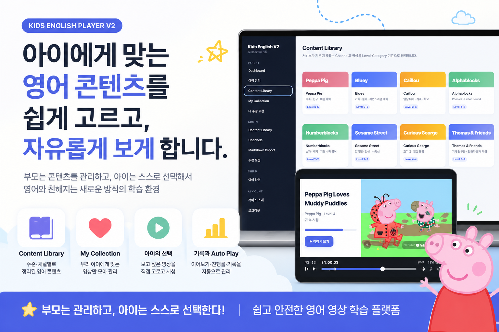
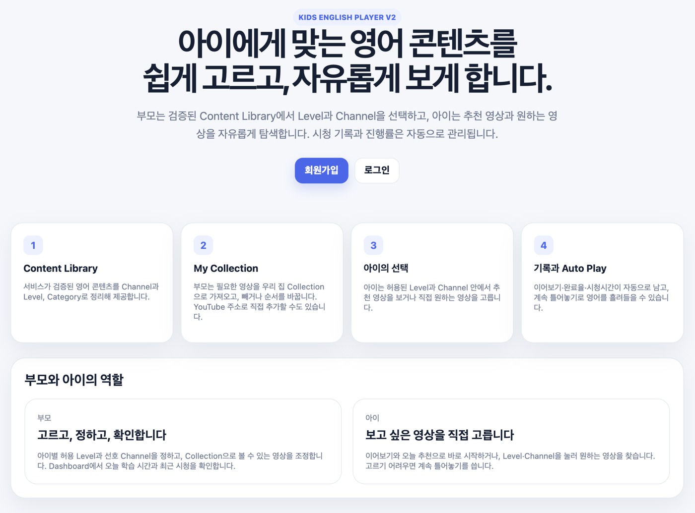
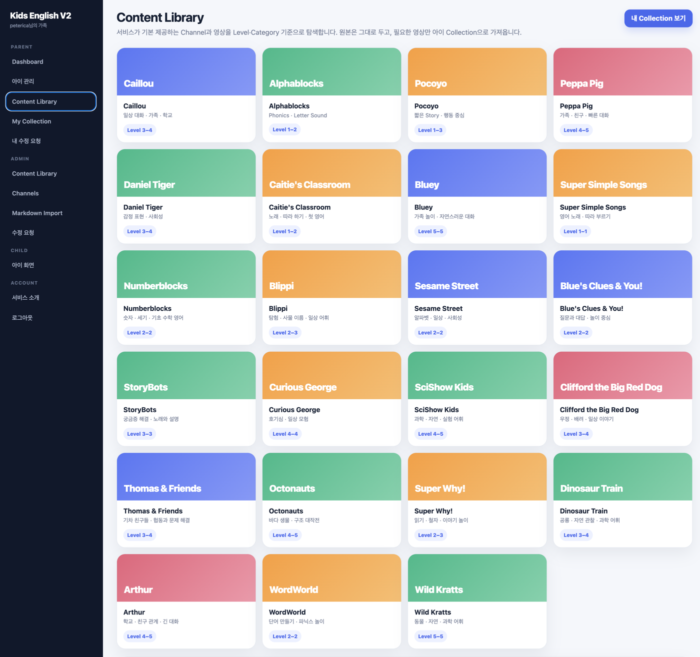
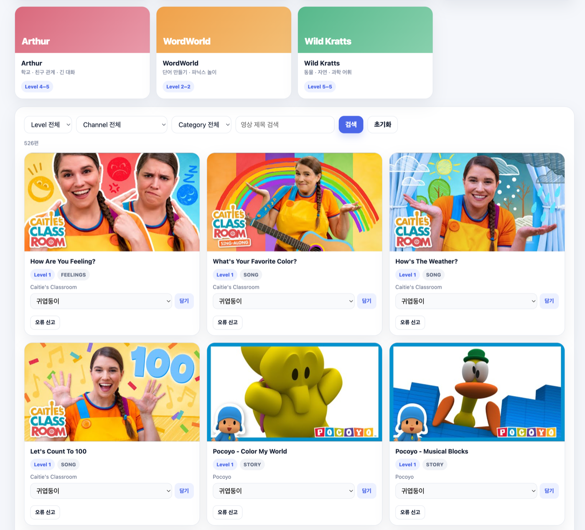
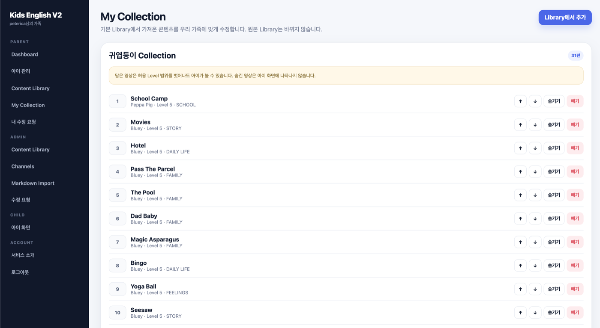
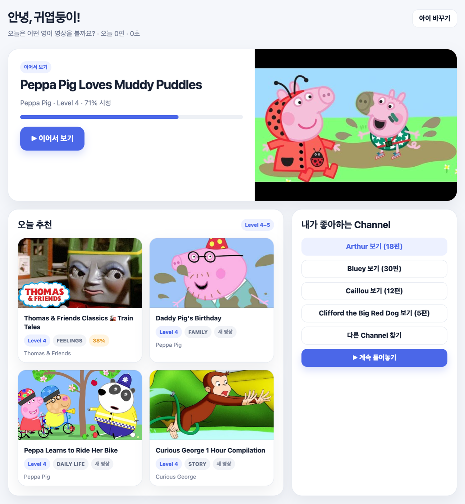
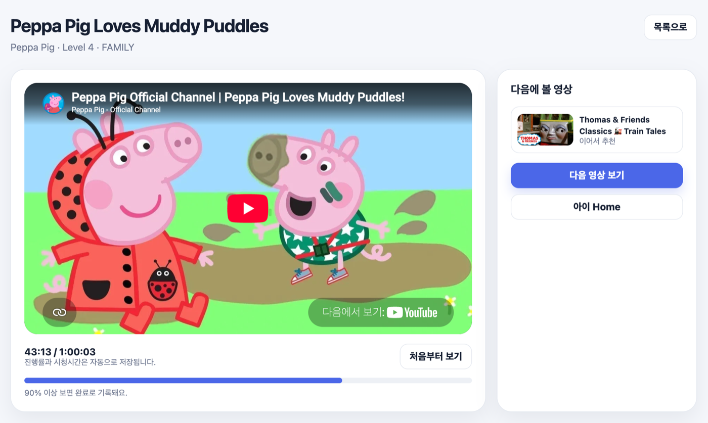
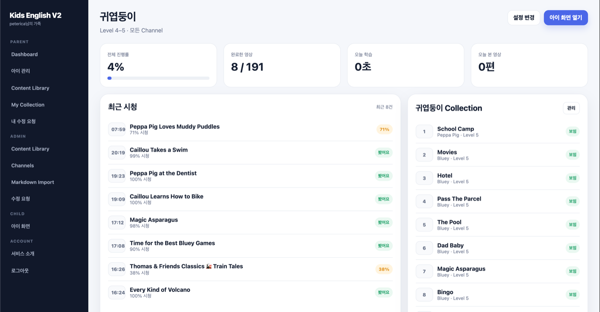

# Kids English Player V2

**A self-hosted web app that lets parents curate English-language YouTube videos for their
kids — and lets kids freely pick what to watch inside those boundaries.**

- **Content Library** — 526 hand-picked videos across 23 channels, tagged by level (1–5) and category
- **Per-child collections** — parents set allowed levels and channels; kids browse only what's allowed
- **Automatic progress** — resume position, watch time, and completion (90%) recorded per child
- **Nothing in the cloud** — one SQLite file on your own machine. No email, no real names, no analytics

MIT licensed. Personal project — no support guaranteed.

Runs with `docker compose up -d --build`, seeded and ready on first boot.
Documentation below is in Korean.

---

부모가 검증된 영어 영상 **Content Library**에서 아이에게 맞는 Level과 Channel을 고르고,
아이는 **추천 · 자유 탐색 · Auto Play**로 영어 콘텐츠를 보는 가정용 웹 서비스다.
시청 진행률과 학습 기록은 아이별로 자동 저장된다.

- 부모: Library 탐색 → 아이 Collection 구성 → 허용 Level·선호 Channel 지정 → Dashboard 확인
- 아이: 이어보기 · 오늘 추천 · 원하는 영상 고르기(Level/Channel) · 계속 틀어놓기
- 데이터: SQLite 파일 하나 (`data/app.db`)
- 개인정보: **이메일 · 실명 · 연락처를 받지 않는다.** 아이디와 별명만 쓴다

원칙은 하나다. **부모는 좋은 콘텐츠의 경계를 만들고, 아이는 그 안에서 자유롭게 선택한다.**



> **MIT 라이선스**로 공개된 개인 프로젝트다 (`LICENSE`). 자유롭게 쓰고 고쳐도 된다.
> 다만 개인 프로젝트라 지원을 보장하지 않는다.
> 재생은 **공개된 YouTube 영상의 공식 임베드**로만 이뤄지며 영상을 저장·재배포하지 않는다.
> 채널·프로그램 이름은 각 권리자의 상표이며, 이 프로젝트는 그들과 무관하다 —
> [콘텐츠 정책](docs/CONTENT_POLICY.md)

---

## 화면

만들게 된 배경과 설계 의도는 소개 글에 정리했다 —
[Kids English Player - 아이가 직접 고르는 영어 영상 학습 서비스](https://peterica.tistory.com/1126)

### 부모 — 콘텐츠의 경계를 정한다

**Content Library** — 서비스가 기본 제공하는 채널을 Level·Category로 정리해 보여준다.



**Library에서 담기** — Level·Channel·Category·제목으로 찾아 아이 Collection에 담는다.
잘못된 정보가 보이면 그 자리에서 오류 신고를 보낼 수 있다.



**My Collection** — 아이별로 순서를 바꾸고, 숨기고, 뺀다. 원본 Library는 바뀌지 않는다.



### 아이 — 그 안에서 자유롭게 고른다

**아이 화면** — 이어서 보기, 오늘 추천, 좋아하는 Channel. 고르기 어려우면 계속 틀어놓기.



**영상 재생** — YouTube 공식 플레이어로 재생하고, 진행률과 시청시간은 자동으로 저장된다.
90% 이상 보면 완료로 기록된다.



### 기록은 부모가 확인한다

**Dashboard** — 전체 진행률, 완료한 영상, 오늘 학습 시간, 최근 시청 기록.



---

## 무엇이 아닌지

오해를 줄이기 위해 먼저 적는다.

- **클라우드 서비스가 아니다.** 우리 집 서버나 노트북에서 직접 띄워 쓴다. 가입할 곳이 없다.
- **중앙 계정 서버가 없다.** 계정은 그 서버의 SQLite 파일 안에만 있고, 다른 가정과 공유되지 않는다.
- **영상을 저장하거나 재배포하지 않는다.** YouTube 공식 임베드로 재생만 한다
  ([콘텐츠 정책](docs/CONTENT_POLICY.md)).
- **분석 도구·트래킹이 없다.** 시청 기록은 서버 밖으로 나가지 않는다.
- **아이 계정이 아니다.** 아이는 로그인하지 않는다. 부모 계정 아래의 프로필로만 존재한다.
- **학습 커리큘럼이 아니다.** 문제·평가·레벨테스트가 없다. 좋은 콘텐츠에 자연스럽게 노출되는 환경을 만드는 데 집중한다.

> ⚠️ **가정 내부 네트워크(LAN) 전제로 만들었다.** HTTPS 가 없고 아이 화면에 별도 인증이 없다.
> 인터넷에 포트를 열기 전에 [SECURITY.md](SECURITY.md) 를 먼저 읽어 주기 바란다.

---

## 빠른 시작 (Docker)

Node 를 설치하지 않아도 된다. Docker 만 있으면 된다.

```bash
git clone https://github.com/peterica/kids-english-player.git
cd kids-english-player

cp .env.example .env
# SESSION_SECRET 을 무작위 값으로 채운다 (macOS 기준)
sed -i '' "s|change-me-to-a-long-random-string|$(openssl rand -hex 48)|" .env

docker compose up -d --build
```

→ <http://localhost:3200>

컨테이너는 기동할 때 DB migration 과 Content Library seed 를 자동 실행한다.
따라서 **첫 실행만으로 23개 채널 · 526편이 채워진 상태**로 시작한다.

첫 사용 순서:

```text
1. http://localhost:3200 → 계정 만들기
   (아이디 · 비밀번호만. 이메일 · 실명은 받지 않는다)
   → **첫 계정은 자동으로 ADMIN** 이 되어 운영자 화면까지 바로 쓸 수 있다
2. 부모 화면에서 아이 별명을 추가하고 허용 Level · 선호 Channel 지정
3. 비밀번호를 잊었다면 서버에서 재설정한다 (이메일 복구 없음):
   docker compose exec -w /app app \
     node ./node_modules/tsx/dist/cli.mjs prisma/reset-password.ts <아이디>
```

| 항목 | 값 |
|---|---|
| 데이터 위치 | 호스트의 `./data/app.db` (볼륨 마운트) |
| 백업 | `./data` 폴더 복사 |
| 포트 변경 | `.env` 에 `PORT=3300` |
| 중지 / 재시작 | `docker compose down` / `docker compose up -d` |
| 로그 | `docker compose logs -f` |

`.env` 없이 실행하면 `SESSION_SECRET` 이 없다는 안내와 함께 기동이 중단된다.

---

## 문서

| 문서 | 내용 |
|---|---|
| [docs/ARCHITECTURE.md](docs/ARCHITECTURE.md) | 구조와 설계 결정 |
| [docs/V2_CONCEPT.md](docs/V2_CONCEPT.md) | 제품 컨셉(원본 사양) |
| [docs/V2_USER_EXPERIENCE.md](docs/V2_USER_EXPERIENCE.md) | 화면·사용 흐름 사양 |
| [docs/V2_MOCKUP.html](docs/V2_MOCKUP.html) | 초기 목업 |
| [docs/IMPLEMENTATION_RESULT.md](docs/IMPLEMENTATION_RESULT.md) | 작성자의 구현·검증 기록 (설치 안내 아님) |
| [docs/CONTENT_HARNESS.md](docs/CONTENT_HARNESS.md) | Content Library 확장 작업 루프 |
| [docs/CONTENT_POLICY.md](docs/CONTENT_POLICY.md) | 콘텐츠 취급 원칙 |
| [docs/PRIVACY.md](docs/PRIVACY.md) | 무엇을 저장하고 무엇을 저장하지 않는가 |
| [SECURITY.md](SECURITY.md) | 보안 전제와 인터넷 노출 시 주의사항 |
| [CONTRIBUTING.md](CONTRIBUTING.md) | 개발 환경과 PR 기준 |
| [소개 글 (tistory)](https://peterica.tistory.com/1126) | 만들게 된 배경과 설계 의도 |

---

## 기술 스택

```text
Next.js 16 (App Router, Server Components / Server Actions)
TypeScript strict
Prisma 6 + SQLite
YouTube IFrame Player API
Vitest (단위 + 통합)
Docker Compose
```

---

## 로컬 개발 환경 (기여자용)

소스를 고치려면 Node 24 가 필요하다.

```bash
npm install
cp .env.example .env    # 값 수정
```

### 환경 변수

| 변수 | 설명 | 예시 |
|---|---|---|
| `DATABASE_URL` | SQLite 파일 위치. `prisma/schema.prisma` 기준 상대 경로 | `file:../data/app.db` |
| `SESSION_SECRET` | 로그인 세션 쿠키 서명 키. `openssl rand -hex 48` 로 생성 | `9f3c...` |
| `COOKIE_SECURE` | HTTPS 로 서비스할 때만 `true`. LAN(HTTP)이면 비워 둔다 | `false` |

`.env` 는 커밋하지 않는다. 비밀번호는 scrypt 해시로만 저장된다.

### 계정과 개인정보

이 서비스는 **가정별 self-hosted 인스턴스**를 전제로 하며, 중앙 회원 서버가 없다.

| 저장한다 | 저장하지 않는다 |
|---|---|
| 로그인 아이디(`username`) | 이메일 · 전화번호 · 실명 |
| scrypt 비밀번호 해시 | 생년월일 · 성별 · 주소 |
| 아이 별명 · Level · 선호 Channel | 외부 계정 식별자(OAuth 등) |
| 시청 진행률(`childId` 기준) | 아이의 실명 요구 |

```bash
npm run admin:passwd -- appa               # 임시 비밀번호 생성 후 출력
npm run admin:passwd -- appa 새비밀번호8자   # 지정한 값으로 변경
```

이메일 기반 비밀번호 찾기는 제공하지 않는다. 서버에 접근할 수 있는 사람이 위 명령으로 복구한다.

### DB migration / seed

```bash
npm run db:migrate    # 개발: migration 생성 및 적용
npm run db:deploy     # 운영: 기존 migration 적용만
npm run db:seed       # Content Library(채널 23개 · 영상 526편) 등록
npm run db:reset      # 개발 DB 초기화 (데이터 삭제, 주의)
```

seed 는 외부 네트워크를 호출하지 않으므로 오프라인에서도 실패하지 않으며, 여러 번 실행해도 안전하다.
부모가 직접 등록한 영상과 Collection 은 seed 가 건드리지 않는다.

---

## 실행

### 개발

```bash
npm run dev           # http://localhost:3200
```

### Production build

```bash
npm run build
npm start             # 0.0.0.0:3200 바인딩
```

### 상시 실행 서버에 배포

집에 늘 켜두는 기기(미니 PC · NAS · 홈서버 등)가 있다면 거기에 올려두고 쓰면 된다.
기동 방법은 위의 [빠른 시작 (Docker)](#빠른-시작-docker) 과 같고, 갱신은 서버에서 받아 다시 띄우면 된다.

```bash
ssh <user>@<server>
cd /path/to/kids-english-player
git pull
docker compose up -d --build
```

반복해서 배포한다면 `scripts/deploy.sh` 를 쓰면 된다.
백업 → 동기화 → 재빌드 → 기동 확인 → **정리**까지 한 번에 처리한다.

```bash
cp scripts/deploy.env.example scripts/deploy.env   # 서버 주소·경로 입력 (커밋되지 않는다)
scripts/deploy.sh
```

`docker compose up --build` 를 반복하면 **빌드 캐시가 계속 쌓여 디스크를 채운다.**
이 스크립트는 배포가 끝날 때마다 캐시를 상한(기본 5GB) 이하로 줄이고,
DB 백업도 최근 20개만 남긴다. 태그 없는 이미지만 정리하므로 다른 프로젝트의 이미지는 건드리지 않는다.

서버에서 git 을 쓰지 않는다면 개발 머신에서 파일만 동기화해도 된다.
이때 `.env` 와 `data/` 는 **반드시 제외**한다. 서버의 설정과 계정·학습 데이터를 덮어쓰지 않기 위해서다.

```bash
rsync -az --delete \
  --exclude 'node_modules/' --exclude '.next/' --exclude 'data/' --exclude '.env' \
  ./ <user>@<server>:/path/to/kids-english-player/

ssh <user>@<server> 'cd /path/to/kids-english-player && docker compose up -d --build'
```

업데이트 전에 DB 를 복사해 두면 안전하다.

```bash
cp data/app.db backup/app-$(date +%Y%m%d-%H%M).db
```

컨테이너는 기동 시 `prisma migrate deploy` 와 Content Library seed 를 실행한 뒤 서버를 띄운다.
DB 파일은 호스트의 `./data/app.db` 에 남는다(볼륨 마운트).

중지 / 재시작:

```bash
docker compose down
docker compose up -d
```

---

## LAN 접속

서버 IP 를 확인한 뒤 같은 Wi-Fi 기기에서 접속한다.

```bash
ipconfig getifaddr en0     # macOS (유선), 무선은 en1
hostname -I                # Linux
```

```text
http://<server-ip>:3200
http://<hostname>.local:3200
```

> 아이 화면도 부모 로그인 세션 안에서 동작한다. 아이가 쓰는 기기에 부모 계정으로 한 번 로그인해
> 두고 `/kids` 를 즐겨찾기 해 두면 된다. 외부(인터넷) 공개가 필요 없다면 공유기 포트포워딩은 열지 않는 것을 권장한다.

---

## 처음 사용 흐름

```text
/signup   부모 계정 만들기 (이메일 · 비밀번호 · 이름 · 첫 아이 이름)
   ↓
/admin/children   아이 추가, 아이별 허용 Level 범위와 선호 Channel 지정
   ↓
/library   Channel · Level · Category · 검색으로 영상을 찾아 아이 Collection에 담기
   ↓
/collections   숨기기 · 순서 변경 · YouTube 주소로 직접 등록
   ↓
/kids   아이 선택 → 이어보기 / 오늘 추천 / 원하는 영상 찾기 / 계속 틀어놓기
   ↓
/admin   오늘 학습 시간, 아이별 진행률, 최근 시청 확인
```

---

## 주요 route

| URL | 화면 |
|---|---|
| `/intro` | 서비스 소개 (공개) |
| `/signup`, `/login` | 부모 계정 가입 / 로그인 |
| `/admin` | 부모 Dashboard — 아이별 진행·오늘 학습·최근 시청·완료 기준 설정 |
| `/admin/children` | 아이 추가/이름/활성화, 허용 Level·선호 Channel |
| `/admin/children/[childId]` | 아이 상세 — 진행률, 최근 시청, Collection, 볼 수 있는 영상 |
| `/library` | Content Library — Channel/Level/Category/검색, Collection에 담기 |
| `/collections` | My Collection — 숨기기·순서·빼기, YouTube 직접 등록 |
| `/kids` | 아이 선택 |
| `/kids/[childId]` | 아이 Home — 이어보기 · 오늘 추천 · 좋아하는 Channel |
| `/kids/[childId]/browse` | 영상 찾기 — Level / Channel 필터 |
| `/kids/[childId]/watch/[videoId]` | Player |
| `/kids/[childId]/autoplay` | Auto Play 설정 및 재생 |
| `/requests` | 내가 신고한 영상 오류와 처리 상태 (부모) |
| `/admin/content` | **운영자** — Content Library 영상 등록/수정/노출/삭제, 검색·필터 |
| `/admin/content/channels` | **운영자** — Channel 이름/사용 여부 관리 (slug 자동 생성) |
| `/admin/content/import` | **운영자** — Markdown 일괄등록(.md 업로드 / 붙여넣기) |
| `/admin/content/requests` | **운영자** — 부모 수정 요청 처리 |

API: `POST /api/sessions`, `POST /api/progress`, `POST /api/autoplay/next`, `POST /api/autoplay/stop`,
`POST /api/correction-requests`, `GET /api/correction-requests/mine`

운영자 전용 API(모두 `ADMIN` 필요, 미인증 401 / 권한 부족 403):
`/api/admin/videos`(GET·POST), `/api/admin/videos/{id}`(GET·PUT·DELETE), `/api/admin/videos/{id}/enabled`(PATCH),
`/api/admin/videos/import/validate`(POST), `/api/admin/videos/import`(POST),
`/api/admin/channels`(GET·POST), `/api/admin/channels/{id}`(PUT·DELETE), `/api/admin/channels/{id}/enabled`(PATCH),
`/api/admin/correction-requests`(GET), `/api/admin/correction-requests/{id}/status`(PATCH)

### 컨테이너 경유 운영 명령

Docker 로 운영한다면 서버 호스트에 Node 나 `node_modules` 를 둘 필요가 없다.
관리 명령은 실행 중인 컨테이너 안에서 돌린다. (컨테이너에 Prisma CLI 와 tsx 가 들어 있다)

```bash
# 운영자 권한 부여 / 회수  ─ 첫 계정은 자동 ADMIN 이라 보통은 불필요
docker compose exec -w /app app \
  node node_modules/tsx/dist/cli.mjs prisma/grant-admin.ts <아이디>
docker compose exec -w /app app \
  node node_modules/tsx/dist/cli.mjs prisma/grant-admin.ts <아이디> --revoke

# 비밀번호 재설정 (이메일 복구가 없으므로 이 방법으로 복구한다)
docker compose exec -w /app app \
  node node_modules/tsx/dist/cli.mjs prisma/reset-password.ts <아이디>

# Content Library seed (idempotent) — 컨테이너 기동 시 자동 실행되므로 보통은 불필요
docker compose exec -w /app app \
  node node_modules/tsx/dist/cli.mjs prisma/seed.ts

# migration 상태 확인 (읽기 전용)
docker compose exec -w /app app \
  node node_modules/prisma/build/index.js migrate status

# DB 백업 (호스트에서, 무중단)
sqlite3 data/app.db ".backup 'backup/app-$(date +%Y%m%d-%H%M).db'"
```

Node 버전은 개발 환경·서버·컨테이너 모두 24 계열로 맞추는 것을 권장한다.

### 운영자(ADMIN) 권한

**첫 계정은 가입할 때 자동으로 ADMIN** 이 된다(단일 가정 인스턴스 전제).
두 번째 이후 계정은 PARENT 로 만들어지며, 필요하면 아래로 권한을 조정한다.
운영자는 별도 계정 체계가 아니라 `HouseholdMember.role` 값이다. seed 는 role 을 건드리지 않는다.

```bash
npm run admin:grant -- appa            # 권한 부여
npm run admin:grant -- appa --revoke   # 회수(PARENT 로 되돌림)
```

- ADMIN 은 기존 부모 기능을 그대로 쓰면서 좌측 메뉴에 Admin 영역이 추가된다.
- 부모(PARENT)는 Content Library 원본을 수정할 수 없고, 영상 카드의 "오류 신고"로 수정 요청만 보낼 수 있다.
- Markdown 일괄등록은 `| Level | Title | Category | Publisher | YouTube URL |` 다섯 컬럼이 필요하며(순서 무관),
  검증 결과를 행 단위로 미리 보고 정상 행만 골라 등록한다.

### Content Library 읽기 전용 API

콘텐츠 현황을 외부(예: 콘텐츠 조사 도구)에서 확인하기 위한 읽기 전용 엔드포인트다.

```text
GET /api/content-library
GET /api/content-library?level=3
GET /api/content-library?channel=caillou      # slug · 이름 · id 모두 허용
GET /api/content-library?channel=caillou&level=4
```

```json
{
  "count": 8,
  "filters": { "level": null, "channel": "caillou" },
  "videos": [
    {
      "channel": "Caillou",
      "level": 3,
      "category": "SCHOOL",
      "title": "Caillou Goes to School",
      "youtubeUrl": "https://www.youtube.com/watch?v=gavAXKvzLQs",
      "enabled": true
    }
  ]
}
```

- 공용 Library 영상만 돌려준다. 부모가 직접 등록한 가정 전용 영상, 사용자·아이·진도·Collection 데이터는 포함하지 않는다.
- 쓰기(추가/수정/삭제) API 는 제공하지 않는다.
- `CONTENT_LIBRARY_TOKEN` 을 설정하면 `?token=...` 또는 `Authorization: Bearer ...` 가 있어야 조회된다. 비워 두면 공개다.

---

## Content Library 문서 백업

DB 와 별개로, 콘텐츠 목록을 사람이 읽고 다시 가져올 수 있는 문서로 내보낸다.

```bash
npm run content:export              # content-backup/ 에 생성
npm run content:export -- <디렉터리>
```

```text
content-backup/
  README.md              채널 요약표 · 복구 방법
  content-library.json   기계 판독용 스냅샷
  channels/<slug>.md     채널별 일괄등록 표 (그대로 붙여 넣으면 복구)
```

채널별 Markdown 은 운영자 화면의 일괄등록 형식과 동일해서 **그대로 복구에 쓸 수 있다.**
계정·아이·시청기록은 내보내지 않으며, 가정이 직접 등록한 영상도 제외한다(개인 데이터).

원본은 여전히 `prisma/seed-content.ts` 다. `content-backup/` 은 특정 시점의 스냅샷이므로,
콘텐츠를 바꾼 뒤에는 다시 내보내야 최신 상태가 된다.

---

## DB 백업

SQLite 파일 하나만 복사하면 된다.

```bash
# 실행 중에도 안전하게 백업
sqlite3 data/app.db ".backup 'backup/app-$(date +%Y%m%d).db'"

# 또는 중지 후 복사
docker compose down
cp data/app.db ~/Backup/app-$(date +%Y%m%d).db
docker compose up -d
```

복구는 `data/app.db` 를 백업 파일로 교체한 뒤 재시작한다.

---

## 검사 / 테스트

```bash
npm test         # Vitest (단위 + 통합)
npm run lint     # ESLint
npm run typecheck
npm run build
```

---

## 알아두면 좋은 동작

- Level 은 학습 경로가 아니라 **영상의 난이도 속성**이다. `Level 3 + Caillou` 처럼 자유롭게 조합된다.
- 아이가 볼 수 있는 영상 = 허용 Level 범위 + 선호 Channel + Collection에 담은 영상 − Collection에서 숨긴 영상.
- 완료 기준은 기본 90%이며 `/admin` 에서 바꾼다. YouTube 재생 종료(ENDED)도 완료로 처리한다.
- 시청 시간은 실제 재생 중 흐른 시간만 쌓인다. 앞으로 건너뛰기(seek)로는 늘어나지 않는다.
- 재생하지 않고 영상 화면만 열었다 나가면 기록이 남지 않는다.
- Auto Play로 본 영상도 일반 재생과 같은 진행률·시청 기록에 남는다.
- 부모가 직접 등록한 영상은 그 가정에서만 보인다(공용 Library를 바꾸지 않는다).
